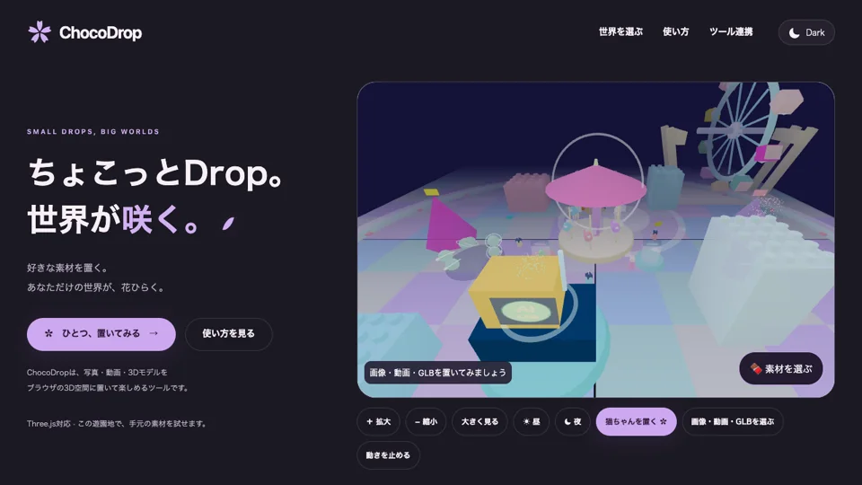

# ChocoDrop

ちょこっとDrop。世界が咲く。<br>
Drop a little, bloom a lot.

**写真・動画・3Dモデルを、Three.jsで作られたブラウザの3D空間に置いて楽しむツールです。**

<div align="center">

**[Website](https://nyukicorn.github.io/chocodrop/)** · **[Try the playground](https://nyukicorn.github.io/chocodrop/#home)** · **[Setup guide](https://nyukicorn.github.io/chocodrop/getting-started.html)**

[](https://nyukicorn.github.io/chocodrop/assets/chocodrop-preview.mp4)

_短い動画を見る（音声なし・約18秒）_

</div>

## まず試す

公開サイトの遊園地で、サンプルの猫または手元のファイルを配置できます。アカウント、APIキー、GitHubのcloneは不要です。

1. [ChocoDropを開く](https://nyukicorn.github.io/chocodrop/#home)
2. 「猫ちゃんを置く」または「画像・動画・GLBを選ぶ」を押す
3. ドラッグで景色を見回す

対応形式はPNG・JPEG・WebP、MP4・WebM、外部ファイルを参照しないGLB 2.0です。トップの遊園地では1ファイル32MiBまで、素材はブラウザ内だけで読み込みます。ページを再読み込みすると配置は消えます。

## 4つの使い方

| やりたいこと | 入口 | GitHub clone | 現在の状態 |
| --- | --- | --- | --- |
| 世界と素材配置をすぐ試す | [公開サイト](https://nyukicorn.github.io/chocodrop/#home) | 不要 | 利用可能 |
| 手元のThree.jsページにUIを加える | [ブックマークレット](https://nyukicorn.github.io/chocodrop/examples/bookmarklet-v2.html) + ローカルdaemon | 不要 | Chromeで検証 |
| 会話から素材を配置する | ローカルMCP（Codex・Claude Code・Gemini CLI） | 必要 | 利用可能 |
| 自分のThree.jsアプリへ組み込む | SDK + ローカルdaemon | 必要 | 開発者向け |

### ブックマークレット

既存のThree.jsページでブックマークを押すと、ChocoDrop UIを読み込みます。

```bash
npx --yes @chocodrop/daemon@alpha
```

daemonを起動したまま[ブックマークレット登録ページ](https://nyukicorn.github.io/chocodrop/examples/bookmarklet-v2.html)を開き、「ChocoDropを登録」をブックマークバーへドラッグします。

ブックマークレットが素材をシーンへ配置できるのは、対象ページがThree.jsの`scene`・`camera`・`renderer`をグローバルに公開している場合です。モジュール内部に閉じたシーン、Content Security Policyでローカルスクリプトを禁止しているページ、Three.js以外の3Dエンジンでは利用できないことがあります。詳しくは[ブックマークレットガイド](docs/BOOKMARKLET.md)をご覧ください。

### Codex・Claude Code・Gemini CLI

ChocoDropのstdio MCPは、許可した素材フォルダ内のファイルをローカルのブラウザシーンへ配置します。画像や動画を生成するMCPではありません。普段の制作ツールで作ったファイルを、配置するための入口です。

```bash
git clone https://github.com/nyukicorn/chocodrop.git
cd chocodrop
npm ci
npm run build
```

各ツールへの登録コマンドと、`get_status`・`import_asset`の使い方は[ローカルMCPガイド](docs/LOCAL_TOOLS.md)にまとめています。

## デモの世界

- [ちいさな遊園地](https://nyukicorn.github.io/chocodrop/examples/toy-city/)
- [音楽の花園](https://nyukicorn.github.io/chocodrop/examples/music-garden/)
- [海底世界](https://nyukicorn.github.io/chocodrop/examples/pixel-ocean/)
- [宇宙空間](https://nyukicorn.github.io/chocodrop/examples/space/)
- [侘び寂び](https://nyukicorn.github.io/chocodrop/examples/wabi-sabi/)
- [Lo-fi Room](https://nyukicorn.github.io/chocodrop/examples/lofi-room/)

各デモはThree.jsとWebGLを使用します。WebGLを使うすべてのサイト、WebGPU、他の3Dエンジンへの対応を意味するものではありません。

## ローカル開発

Node.js 22 LTSとnpmを推奨します。

```bash
npm ci
npm run build
npm run local -- --assets-dir /absolute/path/to/your/assets
```

検証は次の1コマンドで実行します。

```bash
./scripts/check.sh
```

Node単体テスト、ブラウザバンドル、daemon契約テスト、GitHub Pages成果物の生成を確認します。

## ドキュメント

- [はじめ方・ツール連携](getting-started.html)
- [ローカルMCP](docs/LOCAL_TOOLS.md)
- [ブックマークレット](docs/BOOKMARKLET.md)
- [Three.jsへの統合](docs/INTEGRATION.md)
- [トラブルシューティング](docs/TROUBLESHOOTING.md)
- [Quest / XRの検証](docs/quest-testing.md)

## 現在の境界

- GitHub Pagesは静的サイトです。MCPサーバーやdaemonは利用者のPCで起動します。
- 公開サイトの手動ImportとローカルMCPは、素材生成サービスやAPIキーを必要としません。
- 旧来の内部生成連携は残っていますが、現在の公開導線では案内していません。
- Meta Quest・XR機能はブラウザ版とは別に検証中です。

## License

[MIT](LICENSE)
