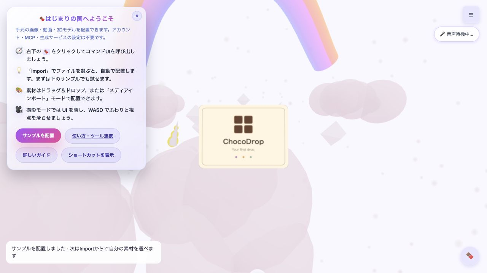

# Pages・ローカルMCP再開版

## 対象

公開main (`3f294e0`) を基準に、独立ブランチ `codex/pages-local-mcp` にまとめた変更です。

- トップページとBasicデモから、設定不要のサンプル配置・ファイルImportへ案内。
- 任意のAI・CLIが生成したローカル素材を、stdio MCPの `get_status` / `import_asset` で配置。
- SceneManagerのXR状態初期化より前の参照を修正。
- Pages用成果物を `dist/pages` に集約し、CIに新規テストと成果物検証を追加。
- ブラウザ配布物はこのブランチのソースから再生成。以前の配布物との間に蓄積した差分も含みます。

## 検証

2026-09-16、クリーンなworktreeで実施。

- 公開mainのpackage-lockを変更せず `npm ci` 成功。標準キャッシュが書込不可だったため、作業用キャッシュを指定。
- `./scripts/check.sh`: exit 0（ルート8テスト、daemon9テスト、Rollupビルド、Pages成果物53ファイル）。
- 静的成果物をHTTP配信し、実ブラウザでBasicデモ起動 → サンプル配置成功を確認。console errorなし。
- 手書き差分の `git diff --check` 合格。生成バンドルには既存ソース由来の空白差分あり。

## 公開手順

1. ブランチをGitHubへpushし、PRで差分とCI結果を確認。
2. GitHub PagesのBuild and deployment SourceをGitHub Actionsへ変更。現状はmainルートからのlegacy公開設定。
3. mainへマージ。Deploy to GitHub Pagesが `dist/pages` を公開。
4. 公開トップ、getting-started、Basicデモのサンプル配置を確認。

公開設定の変更とpush/マージは承認後に実行します。npmへの公開は含みません。

## 残る確認

- Cursor実アプリからの接続とQuest実機は未検証。stdio MCPはSDKクライアントと単体テストで検証。
- MCPのサーバーは利用者PC上で実行。GitHub Pagesでは静的デモのみ。
- 従来のKAMUI生成経路は互換性のため残し、新しい入口では呼び出しません。
- 既存の依存パッケージに非推奨警告あり。依存更新はこの変更に含めません。

利用手順: [LOCAL_TOOLS.md](LOCAL_TOOLS.md)
