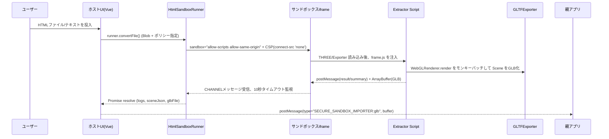

# Secure Sandbox Importer

ChocoDrop の HTML 取り込み経路に、ユーザー単一 HTML を分離実行して GLB を抽出する "Secure Sandbox Importer" を追加しました。Vue ベースのホスト UI と、Three.js フック付き Extractor の 2 コンポーネントで構成されます。

## シーケンス図

## ホスト (Parent) 実装
- HTML: `secure-sandbox-importer.html`
  - Import Map で Vue 3 を読み込み、UI フレーム/スタイルを構築。
  - ファイル入力＋テキストエリアを備え、10秒タイムアウト前提の状態表示を行います。
- Vue ロジック: `src/pwa/html-sandbox/secure-importer-app.js`
  - `HtmlSandboxRunner` を呼び出し、HTML テキストを Blob→File 化して sandbox iframe を生成。
  - GLB `File` を `URL.createObjectURL` でプレビュー、同時に `window.parent.postMessage` で親アプリへ `ArrayBuffer` 転送。
  - ドラッグ＆ドロップ、フォーム、ログ表示、ビジー制御、beforeunload 時の OPFS/URL 解放を実装。
- Service Worker: `service_worker.js`
  - 新ページ/モジュールを `CORE_ASSETS` に追加し、PWA キャッシュで即座に利用できるようにしています。

## ゲスト (Extractor) 実装
- フレームコード: `public/html-sandbox/frame.js`
  - `THREE.Scene/Object3D` に加え `THREE.WebGLRenderer.prototype.render` をフック。
  - 初回 `render` 呼び出しをモニタし、捕捉した `scene` を `GLTFExporter` へ投入して GLB を生成。
  - `renderer.dispose()` を強制し、完了後に iframe を破棄して WebGL コンテキストのリークを防止。
  - `connect-src 'none'` な CSP + fetch/XHR/WebSocket ガード + Virtual FS で外部通信を遮断。
  - `parent.postMessage` (`CHANNEL = 'chocodrop-html-sandbox'`) に Scene JSON、GLB ArrayBuffer、ログを送付します。
- ランナー: `src/pwa/html-sandbox/HtmlSandboxRunner.js`
  - ユーザー HTML に CSP / Config / Extractor を `<head>` 末尾へ注入。
  - Blob URL を iframe `src` にセットし、`sandbox="allow-scripts allow-same-origin"` + `connect-src 'none'` を強制。
  - 10 秒以内に `postMessage` が来なければ iframe を破棄し、`HtmlSandboxError('host-timeout')` を返却します。

以上により、Single File HTML を常に孤立した実行環境で評価し、Scene→GLB を安全に親アプリへ取り込めます。
